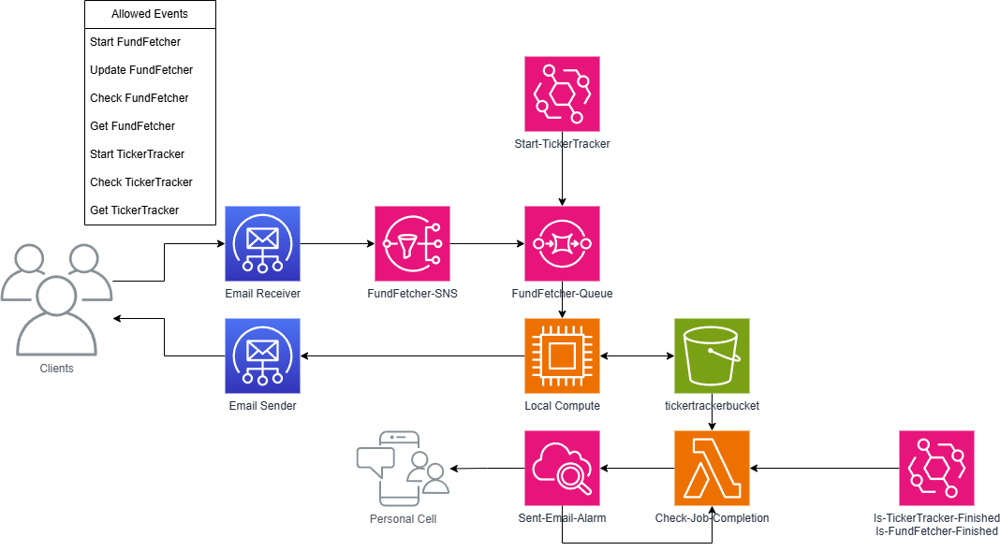

# Fund Fetcher

## Architecture

- FundFetcher-Queue (SQS)
- Start-TickerTracker (EventBridge)
- Check-Job-Completion (Lambda)

## TODO List

- [ ] Merge TickerTracker into FundFetcher Code
- [ ] FundFetch using the screener
- [ ] Create Client documentation
- [ ] Fix unit tests
- [ ] Create Live Dependency Tests
- [ ] Implement AWS Architecture
  - [ ] Implement Check-Job-Completion
